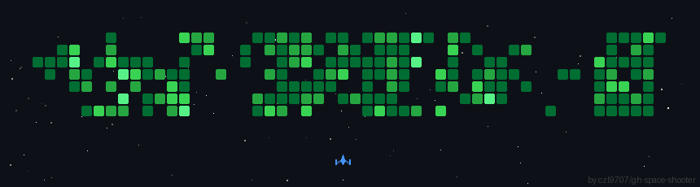

[//]: # ""

[//]: #
[//]: # ""
[//]: # ""
[//]: #
[//]: # "👋 Hello, I'm Ayush, full stack developer with a focus on building robust web applications using React and NodeJS."
[//]: #
[//]: #
[//]: # "📫 Feel free to reach out via email ayushagarwal.dev@gmail.com "
[//]: #
[//]: # " "

## 💼 Tech Stack:
<!-- Languages -->

<!-- AI & LLM Engineering -->

<!-- Fullstack & Cloud -->

<!-- Tools -->

<!--  -->

<!-- 
 -->

<!-- ## 🛠️ Tools: -->

[//]: # " "
[//]: #
[//]: # "## 📈 GitHub Stats"
[//]: #
[//]: # " "
[//]: #
[//]: # ""
[//]: # " "
[//]: #
